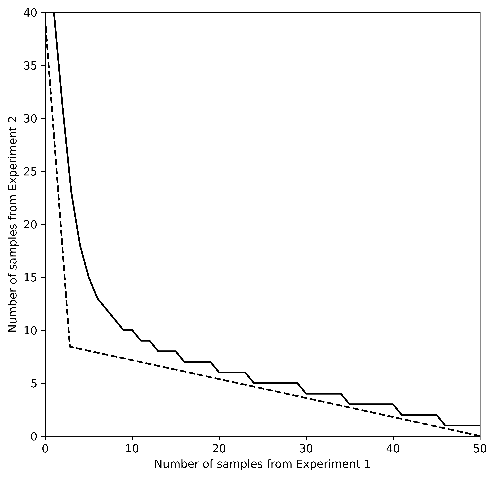
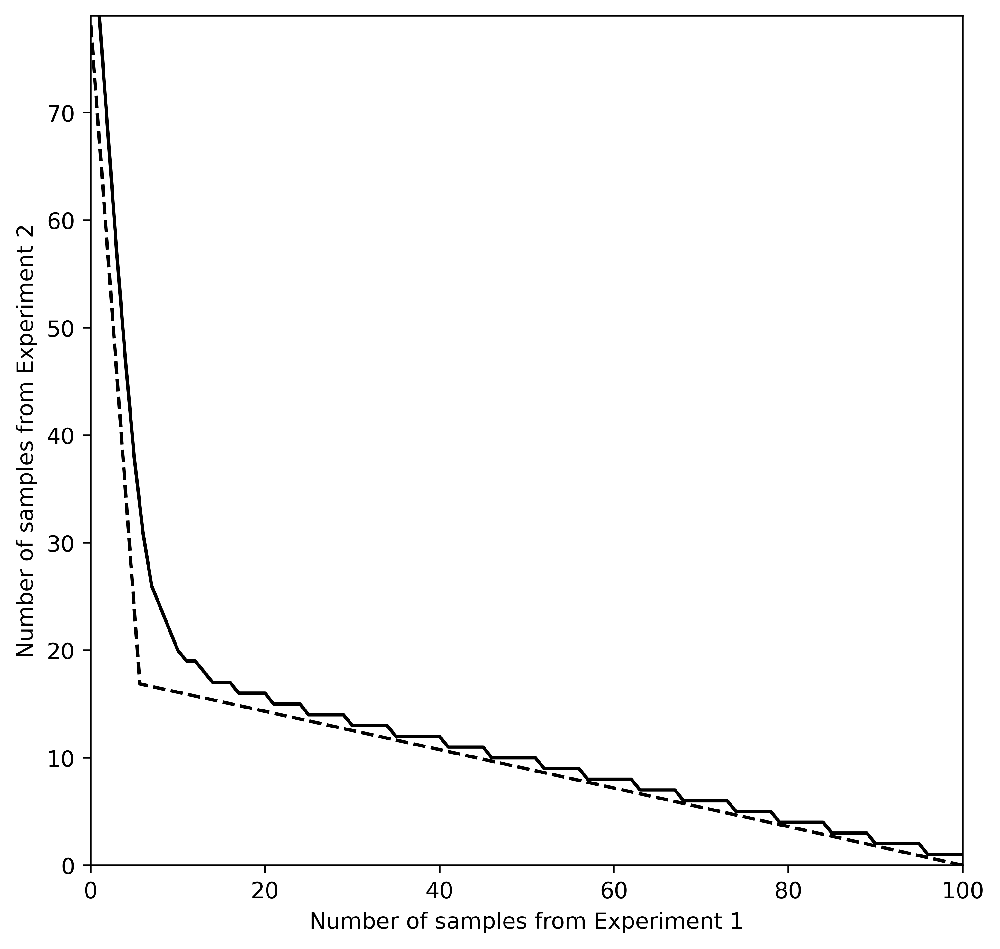

My job market paper considers the substitutability between different
information sources at large sample size---that is, when information is
sufficiently cheap and/or budgets sufficiently large. This file
illustrates the main results using Python.

If you'd like to experiment yourself, the original Jupyter notebook can
be downloaded [here](files/info-consumer-theory.ipynb) (Right click -> "Save
Link As").

# Code setup

First, we need to import a number of standard Python packages:


```python
import numpy as np                   # Basic array stuff
import scipy.optimize as optim       # For finding function mins
from scipy.stats import multinomial  # Multinomial probability computation
import matplotlib.pyplot as plt      # Plotting
from tabulate import tabulate        # For nicer printing of some data
```

# Model

A decision maker must take one of finitely many actions $a\in A$ facing an uncertain state of the world, $\theta$, that is one of finitely many possible states. She has a state-dependent payoff function, $u(a,\theta)$ and chooses her action to maximize expected payoff. Her prior is given by $p\in\Delta\Theta$.

Prior to acting, she may purchase information about the state and update her prior based on that information. As standard, define an information as a *Blackwell experiment*, that is, a collection of state-dependent distributions, $F(r\ |\ \theta)$ over some realization space, R:

$$ 
\mathcal{E} \equiv 
\\{R, \langle F(\cdot\ |\ \theta)\rangle_{\theta\in\Theta}\\} 
$$

(In a fully formal treatment, the definition would also include a σ-algebra. For the purposes of this paper, we can ignore such measure-theoretic complications). 

After observing a realization from an information source, the decision maker can update with Bayes rule:

$$ 
p_\theta'(r) = \frac{p_\theta f(r\ | \ \theta)}{\sum_{\theta'\in\Theta}p_{\theta'}f(r\ |\ \theta')}
$$

To avoid trivialities, assume that no realization perfectly rules in or out any subset of the states, that is, if realization has positive probability (density) under one state, it must have positive probability under all states. (In technical terms, assume the $F(\cdot\ |\ \theta)$ are all mutually absolutely continuous so the Radon-Nikodym derivatives, $dF(\cdot\ |\ \theta')/dF(\cdot\ |\ \theta)$ all exist.) For notational simplicity in this illustration, I'll assume each state-dependent distribution has finitely many possible realizations and thus pmf given by, $f$. 

We can the define an *amount* of information by a number of conditionally independent samples from such a source. 

For illustration, consider a two-state world, $\theta\in\{H,L\}$. An information source might be a coin that is fairly waited in the $L$ state, and biased 70% to heads in the $H$ state. Then samples from this source would simply be the number of coin flips. In an experimental setting, samples would be literal samples under some experimental design.

The DM has a collection of information sources $\mathcal{E}_i,\ldots, \mathcal{E}_I$ from each of which she can purchase an arbitrary number of samples, $\mathbf{n}=[n_i]$, at some cost $[c_i]$ each.

The goal of this paper is to characterize the substitutability of different information sources under the normal Bayesian (ex ante) information value---that is, the expected payoff gain from acting after observing a realization from information source $\mathcal{E}$:

$$
V(\mathcal{E}) \equiv 
\sum_{r\in R} \max_a 
\{\sum_\theta p'_\theta(r) u(a,\theta)\} 
f(r) - \max_a 
\{\sum_\theta p_\theta u(a,\theta)\}
$$
where $f(r)\equiv \sum_\theta p_\theta f(r\ |\ \theta)$ is the unconditional realization probability for the given source.

Information value is typically a very poorly behaved function, so I approach the problem with an asymptotic approach using large deviations methods.


Throughout this notebook, I'll be working with a 3 state decision problem.


```python
numstates = 3
```

# Composite information sources and information values

## Defining information sources

In order to simulate information values, we need a way to define Blackwell experiments in a way amenable to computation: Define an information source as a $|\Theta|\times|R|$ matrix, so each row of the matrix lists the probability of each realization in that state. I will typically use Q to denote such a matrix.

The following function will generate a random information source:


```python
def rand_source(numstates, numrealizations):
    # generate a random array with the appropriate dimension
    Q = np.random.rand(numstates, numrealizations)
    # normalize so each row sums to 1
    for state in range(numstates):
        Q[state, :] = Q[state, :] / np.sum(Q[state, :])
    return Q


Q1 = rand_source(numstates, 2)
Q2 = rand_source(numstates, 3)
Qperfect = np.eye(numstates)   # Perfect information source

# The following two make nice plots
Q1 = np.array([[0.42, 0.58],
               [0.63, 0.37],
               [0.03, 0.97]])
Q2 = np.array([[0.07, 0.18, 0.75],
               [0.45, 0.19, 0.36],
               [0.45, 0.05, 0.50]])

# state labels. Will use for nice output tables
states = []
for stateidx in range(Q1.shape[0]):
    states.append(["State {i}".format(i=stateidx)])

print("Conditional probability of each realization:\n")

# Output table and print
table1 = np.append(states, Q1, axis=1)
realizations1 = ["Q1"]
for realization in range(Q1.shape[1]):
    realizations1.append("R1 =" + " " + str(realization))
print(tabulate(table1, headers=realizations1)+"\n")

table2 = np.append(states, Q2, axis=1)
realizations2 = ["Q2"]
for realization in range(Q2.shape[1]):
    realizations2.append("R2 =" + " " + str(realization))
print(tabulate(table2, headers=realizations2))
```

    Conditional probability of each realization:
    
    Q1         R1 = 0    R1 = 1
    -------  --------  --------
    State 0      0.42      0.58
    State 1      0.63      0.37
    State 2      0.03      0.97
    
    Q2         R2 = 0    R2 = 1    R2 = 2
    -------  --------  --------  --------
    State 0      0.07      0.18      0.75
    State 1      0.45      0.19      0.36
    State 2      0.45      0.05      0.5


Now, we need to be able to quickly compute the matrix for composite experiments. First, we need to be able to compute the matrix for $n$ i.i.d. samples from 1 experiment. 

Since the total number of realizations of each type is a sufficient statistic for the entire vector of realizations, we can simplify things by first computing all of the partitions of $n$ with $|R|$ components (all possible realization sums), the use a multinomial distribution.

The output matrix will be $|\Theta|\times$(number of ways to sum $|R|$ postive integers to add up to $n$) 


```python
# Compute appropriate partitions (returns a generator)
def partitions(n, numrealizations):
    if numrealizations == 1:
        if n >= 0:
            yield (n,)
        return
    for i in range(n+1):
        for result in partitions(n-i, numrealizations-1):
            yield (i,) + result


# Compute matrix for the n-sample source
def n_samples(Q, n):
    numstates = Q.shape[0]
    numrealizations = Q.shape[1]
    if n == 0:                   # return trivial experiment if 0 samples
        return np.ones((numstates, 1))
    QnT = []                     # transpose of Qn
    for outcome in partitions(n, numrealizations):
        outcomeprobs = []        # column of state-dep outcome probs
        for state_idx in range(numstates):
            # create a multinomial with the given outcome probs
            multinom = multinomial(n, Q[state_idx, :])
            outcomeprobs.append(multinom.pmf(outcome))
        QnT.append(outcomeprobs)
    Qn = np.array(QnT).T         # convert to array and transpose
    return Qn

n = 3
realizations1 = [str(n) + " samples of Q1"]
for outcome in partitions(n, Q1.shape[1]):
    realizations1.append(outcome)
table = np.append(states, n_samples(Q1, n), axis=1)
print("conditional probabilities of each sample combination:\n")
print(tabulate(table, headers=realizations1))
```

    conditional probabilities of each sample combination:
    
    3 samples of Q1      (0, 3)    (1, 2)    (2, 1)    (3, 0)
    -----------------  --------  --------  --------  --------
    State 0            0.195112  0.423864  0.306936  0.074088
    State 1            0.050653  0.258741  0.440559  0.250047
    State 2            0.912673  0.084681  0.002619  2.7e-05


Second, we need to be able to composite two *distinct* information sources. If info source $\mathcal{E}_1$ and $\mathcal{E}_2$ have $|R_1|$ and $|R_2|$ possible realizations respectively, then the composite source consisting of 1 sample from each has $|R_1|\times|R_2|$ outcomes. We can get a matrix of all possible combination probabilities by simply by listing out each element of the outer product of the rows of each matrix:


```python
def composite_source(Q1, Q2):
    numstates = Q1.shape[0]
    numrealizations = Q1.shape[1] * Q2.shape[1]
    Qcomp = np.empty((numstates, numrealizations))  # initialize output
    for state in range(numstates):
        # compute all possible combination probs with an outer product
        Qcomp[state, :] = \
            np.reshape(np.outer(Q1[state, :], Q2[state, :]),
                       (numrealizations))           # reshape to vect.
    return Qcomp


Q12comp = composite_source(Q1, Q2)
realizations12 = ["1 from each"]
for r1idx in range(Q1.shape[1]):
    for r2idx in range(Q2.shape[1]):
        realizations12.append("R1={i1}, R2={i2}".format(i1=r1idx, i2=r2idx))
table = np.append(states, Q12comp, axis=1)
print("Conditional probabilties of each combination of realizations from Q1 and Q2:\n")
print(tabulate(table, headers=realizations12))
```

    Conditional probabilties of each combination of realizations from Q1 and Q2:
    
    1 from each      R1=0, R2=0    R1=0, R2=1    R1=0, R2=2    R1=1, R2=0    R1=1, R2=1    R1=1, R2=2
    -------------  ------------  ------------  ------------  ------------  ------------  ------------
    State 0              0.0294        0.0756        0.315         0.0406        0.1044        0.435
    State 1              0.2835        0.1197        0.2268        0.1665        0.0703        0.1332
    State 2              0.0135        0.0015        0.015         0.4365        0.0485        0.485


Note that we repeated composite a matrix with itself to get an equivalent $n$ sample matrix, but this would produce a massive matrix (size $|R|^n$). Most computers would hit memory limititations for any $n$ bigger than 20 or so brute forcing it like that.

## Value of information

In order to compute information value, we must now define a state-dependent utility function and a prior belief. I'll code the utility function as a $|A|\times|\Theta|$ matrix of payoffs where $U_{a\theta}=u(a,\theta)$. The prior can simply be coded as a vector of belief probabilities.


```python
# example payoff matrix (payoff 1 only if choose the correct state
# plus an insurance action that always gives a low payoff)
U = np.eye(numstates)
# example prior vector (diffuse prior)
P = np.ones(numstates) / numstates
```

Information value is typically a fairly tricky thing to compute. In order to maximize computational efficiency, I vectorize the problem where possible. For a given information matrix, $Q$, and payoff matrix $U$, we can write the value *with* information as

$$ W(Q) = \max_D\{\text{tr}(QDU\pi)\}$$

where $pi$ is a matrix who's diagonal elements are the prior probabilities and $D$ is a $|R|\times|A|$ matrix specifying the probability of taking each action after each realization (this is a linear program: $D$ generically is all zeros and ones since each realization generically has a unique optimal response.

([Leshno, 1992](https://cpb-us-w2.wpmucdn.com/campuspress.yale.edu/dist/3/352/files/2013/01/LeshnoSpector92.pdf) uses this formulation to provide an elementary proof of Blackwell's theorem for the finite-action/finite-state case.)

The value *of* information would then be $W(Q)$ minus the payoff from acting with no information. Such a subtraction is a monotone transformation, so it won't affect the ordinal properties I'm interested in.

In order to evaluate how close a bundle is to perfect information, I will sometimes use the ratio of the full-information gap (the difference between the value of a perfect signal and $W(Q)$, relative to the full-info value. This will be a percentage that approaches zero as the amount of samples increases.

None of these approximation would be particularly useful if they require so many samples as to be indistinguishable from a perfect source anyways. I will use thus use this relative info-gap as an ad hoc measure how useful the approximation is. That is, the relavent approximations are useful if they are accurate, even when the relative info-gap is large.


```python
def info_value(Q, U, P):
    numrealizations = Q.shape[1]

    Upi = U @ np.diag(P)
    # compute (actions x realizations) matrix of payoff of each action
    # times unconditional prob of each realization
    Ua = Upi @ Q
    # choose best action for each message then sum across messages
    valuewithinfo = sum(np.amax(Ua, axis=0))
    return valuewithinfo

# relative info gap
def relative_info_gap(Q, U, P):
    return (info_value(Qperfect, U, P) - info_value(Q, U, P)) / info_value(Qperfect, U, P)

# value of info for the examples above
print(tabulate([["Expected value of acting after observing Q1:",
                 info_value(Q1, U, P)]]))
```

    --------------------------------------------  --------
    Expected value of acting after observing Q1:  0.533333
    --------------------------------------------  --------


# Chernoff precision

In the paper, I show that two information sources are exchangeable with ratios of respective precision-like indices of each experiment. In order to define this precision, we must first take a brief detour into large deviations theory.

I approach the problem of approximating information values by approximating the probability of a "mistake" (taking a suboptimal action in a given state). The normal form of Bayes's rule is a bit messy, so instead of working with probabilities, I work with log-likelihood ratios, where Bayes rule becomes a sum:

$$
\log\bigg(\frac{p'_{\theta}(r)}{p'_{\theta'}(r)}\bigg) = 
\log\bigg(\frac{p_\theta}{p_{\theta'}}\bigg) +
\log\bigg(\frac{f(r\ |\ \theta)}{f(r\ |\ \theta)}\bigg)
$$

And, of course, we have no shortage of asymptotic results for approximating sums of many independent distributions.

For a given pair of states, define the Chernoff index of an experiment, $\mathcal{E}_1$, as the minimized value of the moment generating function (MGF) of the distribitution of log-likelihood ratios (LLR):

$$
\rho_1 \equiv \min_t \sum_r f(r\ |\ \theta)^t f(r\ |\ \theta')^{1-t}
$$
(Define $\tau_1$ as the minimizer)

Note that the expected value of the distribution of the above mgf is the negative Kullback-Leibler divergence,  $-D(F(\cdot\ |\ \theta')\ ||\  F(\cdot\ |\ \theta))$.

Note that because MGF of an indpendent sum is the product of MGFs, we have that $n$ samples from $\mathcal{E}_1$ will have Chernoff index $\rho_1^n$.

Furthermore, because the minimum of a sum will be bigger than the sum of minima, we have that the Chernoff index of a composite is more than the sum of its parts:

$$
\rho_{12} \geq \rho_1\rho_2
$$

Now, we can define the Chernoff *precision* for a given state pair of a test by $\beta \equiv -\log(\rho)$. I call this a precision because, for Gaussian tests, it is, up to a multiplicative constant, the same as classical precision ($1/\sigma^2$).

This measure has a number of properties that you might expect for something called a precision

1. For any non-trivial experiment, $\beta>0$
2. $n$ samples from the same experiment has precision $n\beta$
3. Blackwell dominant experiments have higher precision

Intuitively, you can think of the Chernoff precision as measuring how well an information source can distinguish between a given pair of states. 

Because the Chernoff number of a composite is weakly higher than the product of the individual Chernoff numbers, a composite experiment is weakly less precise, for a given state, than the sum of it's parts.


```python
# the following returns the full list of state-pair precisions
# and their respective MGF minimizers
def precisions(Q):
    numstates = Q.shape[0]
    # compute the Chernoff index for each state
    betalist = []
    taulist = []
    for state1 in range(numstates):
        for state2 in range(state1+1, numstates):
            # Define the llr mgf for the given dichtomy
            def llrmgf(t):
                Qstate1t = Q[state1, :]**t
                Qstate2t = Q[state2, :]**(1-t)
                return np.sum(Qstate1t * Qstate2t)
            # Compute index for the dichotomy
            optimizer = optim.minimize(llrmgf, 0.5)
            rho = optimizer.fun
            tau = optimizer.x[0]
            betalist.append(-np.log(rho))
            taulist.append(tau)
    return betalist, taulist


beta1list, tau1list = precisions(Q1)
beta2list, tau2list = precisions(Q2)
beta12list, tau12list = precisions(composite_source(Q1, Q2))
table = np.array([beta12list, [beta1list[i]+beta2list[i]
                               for i in range(len(beta1list))]]).T
print(tabulate(table,
               headers=["composite precisions", "sum of parts"]))
```

      composite precisions    sum of parts
    ----------------------  --------------
                  0.149026        0.149196
                  0.271436        0.276094
                  0.343391        0.343559


Now, it might seem that composites are always worse than the sum of their parts since, for any state pair, the composite is always less precise than the sum of its parts. But the value of information depends generically on a source's ability to distinguish any state from any other. Moscarini and Smith, 2002, showed that, for large sample sizes, the only state pair that matters is the pair hardest to tell apart---i.e. the pair with the least precision (highest Chernoff index).

Thus complementarity often arises when experiments differ in the pair of states they most struggle to distinguish:


```python
beta1 = min(beta1list)
beta2 = min(beta2list)
beta12 = min(beta12list)
print(tabulate([[beta12, beta1+beta2]],
               headers=["min precision of composite", "sum of min precisions"]))
```

      min precision of composite    sum of min precisions
    ----------------------------  -----------------------
                        0.149026                 0.051485


In this particular example, we can see that it is in fact the composite has a *higher* least precision than the sum of least precisions of its parts.

# Plotting "indifference curves"

In particular, at large samples, two bundles of samples will perform equally if they have equal least precision. Information value at large samples is ordinally equivalent to

$$
v(n_1, n_2) \simeq (n_1+n_2)\beta_\omega
$$

where $\beta_\omega$ is the least precision dichotomy for a bundle that is composed of $\omega$ fraction of samples from $n_1$. Furthermore, we can breakdown $\beta_\omega$ into component precisions:

$$
\beta_\omega=\omega\beta_{\omega 1}+(1-\omega)\beta_{\omega 2}
$$

where $\beta_{\omega i}$ is $-\log M_i(\tau_\omega)$, is the negative log of the LLR MGF for the composite's worst-case state pair, evaluated at the composite's minimizer. We can then write

$$
v(n_1, n_2) \simeq n_1\beta_{\omega 1} + n_2\beta_{\omega 2}
$$

Heuristically, then it seems like the MRS between two samples at any bundle with $\omega$ fraction from $\mathcal{E}_1$ must then be the ratio of the component precisions. (For small subsititutions, relative to total sample size, the fraction of samples from each source doesn't change much, so the component precisions don't change much.) 

Additionally, since the value is a min of a sums of precisions, there will be kinks when the least-precision state pair changes.

Of course, samples are fundamentally discrete so there is no MRS. In the paper, I formally define a notion of asymptotic MRS, which basically defines the slope of the boundary between upper and lower contour sets. For the purpose of interpretting things here, it works well enough to just pretend samples are divisible.

First, note that the component precisions only depend on the fraction of the bundle from each source (info value is homothetic). First, I compute the component precision for a given composite factor $\omega$.


```python
n1start = 50
```


```python
# return the component precision for each test at the w composite factor
def comp_precision(Q1, Q2, w):
    numstates = Q1.shape[0]
    # loop over pairs of states
    rho = 0
    for state1 in range(numstates):
        for state2 in range(state1+1, numstates):
            # Define the Hellinger transform for the given dichtomy
            def llrmgf1(t):
                Q1state1_t = Q1[state1, :]**t
                Q1state2_t = Q1[state2, :]**(1-t)
                return np.sum(Q1state1_t*Q1state2_t)

            def llrmgf2(t):
                Q2state1_t = Q2[state1, :]**t
                Q2state2_t = Q2[state2, :]**(1-t)
                return np.sum(Q2state1_t*Q2state2_t)

            def compllrmgf(t):
                return llrmgf1(t)**w * llrmgf2(t)**(1-w)

            # Compute Chernoff for the dichotomy
            optimizer = optim.minimize(compllrmgf, 0.5)
            rhopair = optimizer.fun
            taupair = optimizer.x
            # if new rho is worse (higher), store it
            if rho < rhopair:
                rho = rhopair
                # Store component rhos
                rho1w = llrmgf1(taupair)
                rho2w = llrmgf2(taupair)
    return -np.log(rho1w), -np.log(rho2w)

# return total precision for a composite factor w
def total_precision(Q1, Q2, w):
    beta1w, beta2w = comp_precision(Q1, Q2, w)
    return w*beta1w + (1-w)*beta2w
```

We can then compute points on an indifference curve by using the differential equation defined by the asymptotic MRS ($dn_2/dn_1$):

$$
\text{AMRS}(\omega) = \frac{\beta_{\omega 1}}{\beta_{\omega 2}}
$$

In all the plots that follow, the reference point is the lower right corner bundle consisting entirely of samples from $\mathcal{E}_1$.


```python
def mrs_approx(n1start):
    dn = 0.01
    n1pointsapprox = np.arange(n1start, -dn, -dn)
    n2pointsapprox = []
    n2 = 0
    for n1 in n1pointsapprox:
        w = n1 / (n1 + n2)
        beta1w, beta2w = comp_precision(Q1, Q2, w)
        n2 = n2 + dn*(beta1w/beta2w)
        n2pointsapprox.append(n2)
    return n1pointsapprox, n2pointsapprox


n1pointsapprox, n2pointsapprox = mrs_approx(n1start)
```

Now we can compare this to the true upper/lower contour set computed numerically using the info value function defined earlier. The plot below shows the locus of bundles that are minimally better than the reference point (the maximal boundary for the upper contour set).


```python
def mrs_true(n1start):
    Q1n = n_samples(Q1, n1start)
    startval = info_value(Q1n, U, P)
    # Trace out the lower extent of the UCS
    n2 = 0      # start with no samples from Q2
    n1pointstrue = np.arange(n1start, 0, -1)
    n2pointstrue = []
    for n1loss in range(1, n1start+1):
        Q1n = n_samples(Q1, n1start-n1loss)
        # find minimum samples from Q2 to make better off
        currentval = 0
        while currentval < startval:
            n2 = n2 + 1
            Q2n = n_samples(Q2, n2)
            Qcomp = composite_source(Q1n, Q2n)
            currentval = info_value(Qcomp, U, P)
        n2pointstrue.append(n2)
        n2 = n2 - 1     # decr. n2 just to be sure later
    return n1pointstrue, n2pointstrue


n1pointstrue, n2pointstrue = mrs_true(n1start)
```


```python
fig = plt.figure(figsize=(7, 7), dpi=1000)
ax = fig.add_subplot(1,1,1)
ax.set_xlim((0, n1start))
ax.set_ylim((0, max(n2pointstrue)))
ax.set_xlabel('Number of samples from Experiment 1')
ax.set_ylabel('Number of samples from Experiment 2')
ax.plot(n1pointstrue, n2pointstrue, 'k',
        n1pointsapprox, n2pointsapprox, '--k');
```





Now compute the relative info gap for the indifference curve plotted above. Higher relative info-gap implies the approximation is useful even at small samples.


```python
Q1n = n_samples(Q1, n1start)
print(tabulate([["Relative info-gap:",
                 relative_info_gap(Q1n, U, P)]]))
```

    ------------------  ---------
    Relative info-gap:  0.0438343
    ------------------  ---------


Note that the approximation effectively sets the probability of a mistake other than the most likely one to zero. This approximation then tends to *overestimate* payoffs, and thus the approximate MRS will tend to lie to left of the truth.

In the above plot, we can see that approximation performs relatively well, even at small sample sizes. One limitation is that the approximation will always perform somewhat poorly in a region around a kink for two reasons:
1. The second lowest precision is very close to the lowest, so only accounting for the lowest precision doesn't work as well; and,
2. Because the kinks are inward pointing, total sample size tends to be lower there. In the above example, the corners have total sample size between 40 and 50, but the kink has only about 15 total samples.

But regardless, as sample size increases, we can always get an arbitrarily good approximation for composite factors arbitrarily close to that of any kink point.

Below I plot again, but at twice the sample size to ilustrate the convergence:


```python
n1start = 100
n1pointsapprox, n2pointsapprox = mrs_approx(n1start)
n1pointstrue, n2pointstrue = mrs_true(n1start)
```


```python
fig = plt.figure(figsize=(7, 7), dpi=500)
ax = fig.add_subplot(1,1,1)
ax.set_xlim((0, n1start))
ax.set_ylim((0, max(n2pointstrue)))
ax.set_xlabel('Number of samples from Experiment 1')
ax.set_ylabel('Number of samples from Experiment 2')
ax.plot(n1pointstrue, n2pointstrue, 'k',
        n1pointsapprox, n2pointsapprox, '--k');
```





```python
Q1n = n_samples(Q1, n1start)
print(tabulate([["Relative info-gap:",
                 relative_info_gap(Q1n, U, P)]]))
```

    ------------------  --------
    Relative info-gap:  0.011011
    ------------------  --------

